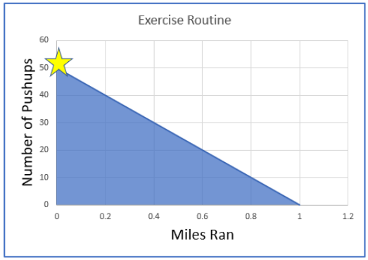

# Supply Chain Analytics in Python

### Basics of Optimization
- Linear Programming (LP) is a Powerful Modeling Tool for Optimization
- It is an optimization method using a mathematical model whose requirements are represented by linear relationships
- There are 3 basic components of LP: 
1. **Decision variables** : or the things that we can control
2. **Objective function** : which describes the goal as a mathematical expression. It is what we want to maximize or minimize, such as profit or costs
3. **Constraints** : Finally, because we live in the real world there are constraints that limit our possible solutions for example manufacturing capicity,
 
#### Example
- Use LP to decide on an excercise routine to burn as many calories as possible in 10 mins

tbl     |     Pushup         | Running          |
:------:|:------------------:|:----------------:|
Minutes | 0.2min per pushup  | 10min per mile   |
Calories| 3cal per pushup    | 130cal per mile  |

- Constraint - only 10 minutes to excercise
- Based on the chart what combination of push-ups and running should we do? Model it as LP problem

#### Basic components of an LP
- **Decision variables** : First, we decide on the decision variables. In this case it is the number of push-ups and miles ran
- **Objective function** : Next, the objective function captures the number of calories burned for each push-up and mile ran. So based on our chart, we add 3 times the number of push-ups to 130 times the number of miles. **Max(3 * number of push-ups + 130 * number of miles) . We want to choose the combination of decision variables that maximizes this function.
- **Constraints** : Finally, we need to express our constraints. (Math expression that describe the limits of a solutions)

##### Constraints 
- 0.2 * Number of Pushups + 10 * Number of miles <=10 : The first constraint captures how many minutes it takes to perform the excercise which must be less than or equal to 10 minutes
- Number of Pushups >= 0 : We also want to ensure our decision variables are not negative
- NUmber of Miles >= 0 

<p align="center">
  
</p>

- The points in the blue area of the graph all satisfy the constraints. To find the overall point that maximizes the calories burned, we can randomly test the shaded area but that would take a long time. In this example the optimal solution is 50 push ups and 0 miles. 

#### LP vs IP vs MIP

Terms                          | Decision Variables
Linear Programming(LP)         | Only continuos
Integer Programming(IP)        | Only Decrete or Integers 
Mixed Integer Programming(MIP) | Mix of continuos and Discrete

- In our example, our decision variables were the number of pushups and the miles ran. We modeled them as continuos variables, meaning the optimal result could mean performing 0.5 push-ups or run 0.1 of a mile.
- The continuous nature of the decision variables make this a linear programming problem.

### Basics of PuLP modeling
- PuLP is a modeling framework for Linear(LP) and Integer Programming(IP) problems.
- PuLP models the problem in python, but relies on a solver to compute a solution.It works with many different solvers like CPLEX, COIN, Gurobi etc.

#### PuLP example - resource scheduling
- Image we are a consultant for a cake bakery that sells only two types of cakes. We are attempting to schedule the resources of the bakery for the next 30 days.
- There is an oven, two bakers and a person who packages the cake.
- In this case, we assume the person packaging will only work 22 of the next 30 days, due to vacation. The amount of time needed with each resource is different for each type of cake. Additionally the profit for the cakes are different.

 tbl   |Cake A     | Cake B      |
:-----:|:---------:|:-----------:|
Oven   | 0.5 days  | 1 day       |
bakers | 1 day     | 2.5 days    |
packers| 1 day     | 2 days      |


tbl    | Cake A    | Cake B      |
:-----:|:---------:|:-----------:|
Profit |  $20.00   | $40.00      |

##### Objective
- Objective is to Maximize profit : `Profit = 20 * A + 40 * B`
- We want to know how many of each type of cake we should make to maximize our profits. Remeber that our profits are subject to the different constraints.

##### Constraints
- Subject to `A >=0 , B >=0`
- The number of cakes produced must be greater than zero.
- `0.5A + 1B <= 30` : The number of cakes of each type produced multiplied by the time needed on the oven gives the total number of days, and this cannot exceed 30 days.
- `1A + 2.5B <= 60` : A similar situtation exists for the bakers. However, because there are 2 bakers the total number of days should not exceed 60 days.
- `1A + 2B <= 22` : Finally, the worker packing is only available 22 days this month.
- **To solve our example we will model it in PuLP**

#### Common modeling process for PuLP
- A common modeling process involves **initializing the model** , **defining the decision variables** , **defining the objective function** , **defining the model constraints** and finally we **solve the model**

##### Initializing model - LpProblem()
- Initializing the model is the first step in the modeling process and for that we use the LpProblem function.

```python
LpProblem(name='NoName', sense=LpMinimize)
```

- It has two inputs first is the text input for the type of problem we are modeling. The second input tells if the model should look to maximize or minimize the objective function. 
- For example, for modeling delivery times we will likely choose to minimize

#### Code
- After importing the package, we initialize the model with LpProblem in our script and choose to maximize.
- Next we look at defining the decision variables. For this we use the `LpVariable` class. This class has 5 inputs. First `name` : name of the variable used in the output.lp file. The next two set the lower and upper bounds of the variable `lowBound` & `upBound`. Their default value is None which sets the bounds to negative infinity for the lower bound or positive infinity for the upper bound. The `cat` input categorizes the variable as either integer, binary or continuous. The last input is related to column based modeling.
- In our example, the variables are how many A & B cakes are produced.We only set the lower bounds and force them to be an integer variable
- Next we define the objective function using our variables.
- Then, we define the constraints. PuLP is able to identify which equations are constraints because of the inequalities.
- Finally, solve the model. The optimized values are stored in `varValue`

```python
from pulp import *

# initialize class
model = LpProblem("Maximize bakery Profits", LpMaximize)

LpVariable(name, lowBound=None, upBound=None, cat='Continuos', e=None)

# Define Decision Variables
A = LpVariable('A', lowBound=0, cat='Integer')
B = LpVariable('B', lowBound=0, cat='Integer')

# define objective function
model += 20 * A + 40 * B

# Define constraints
model += 0.5 * A + 1 * B <= 30
model += 1 * A + 2.5 * B <= 60
model += 1 * A + 2 * B <= 22

# solve model
model.solve()
print("Produce {} Cake A".format(A.varValue))
print("Produce {} Cake B".format(B.varValue))
```

### Using lpSum : Moving from simplex to complex
- We saw simple bakery example. There were 2 products. What if the bakery sold 6 products or more?
- Coding the objective function, or constraints, to sum the different varaibles together will be nearly impossible if our mode contained hundereds or thousands of varaibles. We need a method that scales.
- The PuLP framework provides a function that does just that. `LpSum` , sums a list of linear expressions. It's only input is the list of expressions to sum. `LpSum(vector)`
- Therefore, coding this objective function in PuLP using the addition symbol is equivalent to defining this objective function using lpSum.

```python
# define objective function
model += 20*A + 40*B + 33*C + 14*D + 6*E +60*F

# equivalent to ...
var_list = [20*A, 40*B, 33*C, 14*D, 6*E, 60*F]
model += lpSum(var_list)
```

#### lpSum with list comprehension
- Often lpSum is used with Python's list comprehension. This structure makes it easy to scale the number of variables.

```python
# define objective function
cake_types = ['A', 'B', 'C', 'D', 'E', 'F']
profit_by_cake = {'A':20, 'B':40, 'C':33, 'D':14, 'E':6,'F':60}
var_dict = {'A':A, 'B':B, 'C':C, 'D':D, 'E':E, 'F':F} # pulp lpvariable defined earlier

model += lpSum([profit_by_cake[type] * var_dict[type] for type in cake_types])
```

### LpVariable dictionary function
- Creating LpVariables at scale. Till now we defined each LpVariable separately, typing the code for each one, and created a dictionary called var_dict to hold them.
- However, the LpVariable class has a method called `dicts()` that does just that.

#### Using LpVariable.dicts()

```python
LpVariable(name, indexs, lowBound=None, upBound=None, cat='Continuos')
```

- It creates a dictionary of LP variables saving us the need to type each LpVariable individually. The inputs for this method are similar to the original LpVariable.
- `name` = The prefix to the name of each LP variable created
- `indexs` = A list of strings of the keys to the dict of LP variables. This list will be used as the keys to the dictionary returned by the method.
- `lowBound` = Lower Bound , `upBound` = Upper bound
- `cat` = integer, binary or continuos variable 

#### LpVariable.dicts() with list comprehension
- In Supply chain LP problems often times we need to define a decision variable for every combination of an events.
- Using `LpVariable.dicts()` in combination with list comprehension we can compactly create those combination of decision variables.
- For example, we may need to define a decision variable for each combination of a list of customers and warehouses.
- In below code example, we use list comprehension to loop through every warehouse and every customer to create a larger list that contains tuples for each combination.

```python
# Transport Optimization

# define decision variables
customers = ['East', 'South', 'MidWest', 'West']
warehouse = ['New York', 'Atlanta']
transport = LpVariable.dicts("route", [(w,c) for w in warehouse for c in customers], lowBound=0, cat='Integer')

# define objective function
model += lpSum([cost[(w,c)] * transport[(w,c)] for w in warehouse for c in customers])
```

- The LpVariable.dicts() function then takes this combined list and creates a LpVariable for each item in it with a lowerbound of 0 and category type of Integer.
- Here we use list comprehension when defining the objective function to multiply the cost of shipping from a warehouse to a customer and summing all of those costs together with lpSum.
- This process allows us to create LpVariables at scale.

### Example of a scheduling problem
- Imagine we are hiring truck drivers. Table shows number of estimated drivers needed each day. How many drivers in total we need to hire?
- In this problem each driver works for 5 consecutive days, followed by 2 days off. In US, the number of hours a driver is allowed to drive is highly regulated. Drivers are mandated to rest to eliminate the type of drowsiness that can lead to crashes.
- If we attempt to model this problem as a LP or IP problem how do we define the decision variables?

| Day of week | Drivers Needed |    |Step        | definition                     |
|:-----------:|:--------------:|    |:----------:|:-----------------------------:||
|0 = Monday   |    11          |    |Decision var|xi=the number of drivers working|
|1 = Tuesday  |    14          |    |            |       on day i                 |
|2 = Wednesday|    23          |    |Objective   |minimize=x0+x1+x2+x3+x4+x5+x6   |
|3 = Thursday |    21          |    |subject to  | x0>=11                         |
|4 = Friday   |    20          |    |            |x1 >=14                         |
|5 = Saturday |    15          |    |            |x2>=23                          |
|6 = Sunday   |    8           |    |            |x3>=21, x4 >=20, xi >=0(i=0,..6)|


- We could define the decision variable as the number of drivers that work on each day. However, this presents a number of problems. First, in our objective function we count the same driver multiple times if they work multiple days.
- For example, if a driver works on Monday & Tuesday the objective function is counting the same driver in the count of drivers who work on Monday and the count of drivers who work on Tuesday. This does not help us answer how many drivers do we need to hire. 
- Also we cannot model the constraint that a driver work 5 consecutive days with two days off. It is not uncommon to begin modeling a problem and realize that we may need to adjust our decision variables.
- What happens if we define the decision variable as the number of drivers beginning to work on day i. For X0 is the number of workers who start their 5 consecutive working day on Monday & take Saturday & Sunday off. X1 is the number of workers who start on Tuesday and have Sunday & Monday off.
- With the decision variables in this form our objective function avoids counting the same person multiple times. In addition, our constraint regarding time off is taken care of by how we defined the decision variables. 

|Step        | definition                               |
|:----------:|:----------------------------------------:|
|Decision var|xi=the number of drivers working on day i |
|:----------:|:----------------------------------------:|
|Objective   |minimize=x0+x1+x2+x3+x4+x5+x6             |
|:----------:|:----------------------------------------:|
|subject to  |x0 + x3 + x4 + x5 + x6 >= 11              |
|            |x0 + x1 + x4 + x5 + x6 >= 14              |
|            |x0 + x1 + x2 + x5 + x6 >= 23              |
|            |x0 + x1 + x2 + x3 + x4 >= 21              |
|            |x1 + x2 + x3 + x4 + x5 >= 15              |
|            |xi ? 0 (i=0,.....,6)                      |

- With the decision variables in this form we ensure that a minimum of 11 truckers work on Monday by summing those who start on Monday, and those who start on Thursday through Sunday.
- We skip those who start on Tuesday and Wednesday because after their 5 working days they have Monday off. This same pattern follows through the remainder of the days. While this particular problem focused on scheduling truckers it can be applied in other contexts such as scheduling equipment mandatory downtime for preventive maintainance.
- An important takeaway from this example is that we must choose our decision variables to incorporate some of the constraints of the problem.

#### Code

```python
# initialize class
model = LpProblem("Minimize staffing", LpMinimize)
days = list(range(7))

# define Decision variables
x = LpVariable.dicts('staff_', days, lowBound=0, cat='Integer')

# define objective
model += lpSum([x[i] for i in days])

# define constraints
model += x[0] + x[3] + x[4] + x[5] + x[6] >= 11
model += x[0] + x[1] + x[4] + x[5] + x[6] >= 14
model += x[0] + x[1] + x[2] + x[5] + x[6] >= 23
model += x[0] + x[1] + x[2] + x[3] + x[6] >= 21
model += x[0] + x[1] + x[2] + x[3] + x[4] >= 20
model += x[1] + x[2] + x[3] + x[4] + x[5] >= 15
model += x[2] + x[3] + x[4] + x[5] + x[6] >= 8

# solve model
model.solve() 
```


